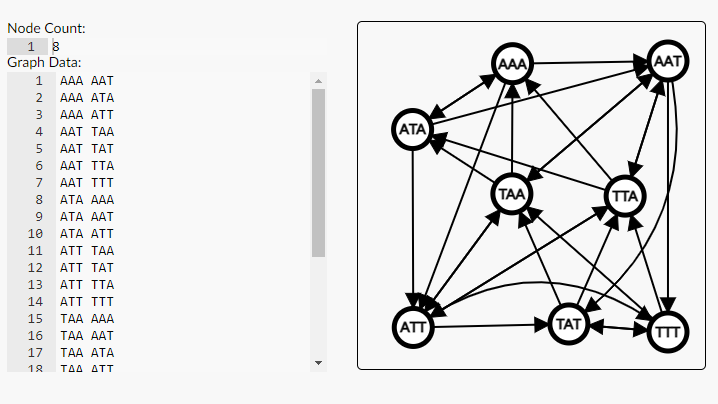

# **TỰ LUẬN**

### **CÂU 3** 

    AAA AAT ATA ATT TAA TAT TTA TTT
8 chuỗi ADN trên là các chuỗi ADN con (không phải duy nhất) được cấu thành từ một ADN gốc, ký hiệu là S.

#### *(a) 2 ví dụ của S.*

S1 = AAAAATTTATTTATTTATATATAA

S2 = AAAATTTTATATAATATATTTTAA

S4 = TAAATATATATTTTTTTAAATAAA

S5 = AAAAATTTAATTTAATATTTTATA

S6 = AAAAATATTAATTTAATTATTTATTTTATAA

S7 = AATTTATAAA

#### *(b) Tìm cận dưới lớn nhất có thể cho độ dài của S. Chứng minh.*

- Tiếp cận - cận dưới lớn nhất: một *số nguyên không âm* và không có số nguyên nào nhỏ hơn nó mà thoả mãn một điều kiện yêu cầu. Vị vậy, ta xác định đây là bài toán *tìm độ dài của chuỗi ADN gốc* sao cho cận dưới lớn nhất là*một số nguyên không âm* và không có số nguyên nào nhỏ hơn nó mà *có thể* là độ dài của một chuỗi ADN gốc chứa tất cả các chuỗi ADN con.

- Để tìm được cận dưới cho độ dài của chuỗi ADN gốc, chúng ta cần xem xét các *đặc điểm* của các chuỗi *ADN con*. 
    + Chuỗi ADN gồm hai loại ký tự: A và T => hai chuỗi ADN con có số lượng ký tự A hoặc T bằng nhau thì chúng sẽ có ít nhất một ký tự chung.
    + Ví dụ: 
        
        - AAA và AAT có 2 ký tự A chung
        
        - ATA và ATT có 1 ký tự A và 1 ký tự T chung
        
        - TTA và TTT có 2 ký tự T chung

    + Phân tích thêm ta nhận thấy mô hình thuật toán Bruijn graph

        - Input: một số nguyên dương m là số ký tự khác nhau $=> m = 2$, một số nguyên dương n là độ dài của các chuỗi ký tự $=> n = 3$, một tập hợp S gồm mn chuỗi ký tự có độ dài n được tạo ra từ m ký tự khác nhau. tức là P{AAA ,AAT, ATA, ATT, TAA, TAT ,TTA, TTT}

        - Đầu ra: một chuỗi ADN gốc chứa tất cả các chuỗi ký tự trong S, có độ dài bằng tổng số ký tự của tất cả các chuỗi ký tự trong S trừ đi tổng số ký tự lặp lại.

        - Vì vậy, ta sẽ gọi từng phần tử trong tập P là các đỉnh của đồ thị có hướng và tạo thành đường đi khi từ đỉnh hậu tố đỉnh $X$ là tiến tố đỉnh $Y$. Ví dụ: ta sẽ nối đỉnh AAA với đỉnh AAT 
        
        - Có thể môi phỏng các đồ thị như sau:
        
            

    >Vì vậy, Để tìm cận dưới lớn nhất có thể cho độ dài của S, ta có thể sử dụng một kết quả quan trọng trong lý thuyết thông tin, đó là [*định lý de Bruijn*](https://en.wikipedia.org/wiki/De_Bruijn_sequence). Định lý này nói rằng nếu ta có một tập hợp gồm $m^n$ chuỗi ADN con có độ dài $n$ từ $m$ ký tự khác nhau, thì độ dài nhỏ nhất của S là $m^n+n−1$.
    
    + Trong trường hợp này, ta có $m = 2$ và $n = 3$ vì ta chỉ sử dụng hai ký tự A và T, và các chuỗi ADN con đều có độ dài 3. Do đó, theo định lý *de Bruijn*, ta có cận dưới lớn nhất cho độ dài của S là $$2^3+3−1=10$$

- Ta nhận thấy để tìm cận dưới cho độ dài của chuỗi ADN gốc, chúng ta cần tìm một đường đi trong đồ thị đi qua tất cả các đỉnh một lần duy nhất. Nếu ta có một tập hợp các chuỗi ADN m là số ký tự khác nhau và một số nguyên dương n là độ dài của các chuỗi ký tự , thì ta có thể xây dựng một *De Bruijn graph* từ tập hợp này. Đồ thị này là một đồ thị có h*ướng biểu diễn các trùng lặp giữa các chuỗi ADN con*. Nếu ta tìm được một chu trình *Euler* trong đồ thị này, tức là một chu trình đi qua tất cả các cạnh một lần duy nhất, thì ta sẽ có được một de Bruijn sequence *chứa tất cả các chuỗi ADN con*.

- Điều này dựa trên mối quan hệ của dựa trên quan hệ giữa *de Bruijn sequence* và de *Bruijn graph*.

#### *(c)Liệu có xâu S nào thỏa mãn cận dưới ở câu (b) hay không? Nếu có, hãy cho ít nhất 1 ví dụ.*

- Đây là một De Bruijn sequence của 2 ký hiệu A và T với độ dài 3, vì nó chứa tất cả các chuỗi ADN con có độ dài 3 từ 2 ký hiệu này. Độ dài của S bằng 10, bằng với cận dưới.

- ví dụ : 
    
    - S = AATTTATAAA ( kết quả này có được dựa vào [De Bruijn sequence](https://www.geeksforgeeks.org/de-bruijn-sequence-set-1/) )
    
    - S = ATAAATTTAT

#### *(d) Ta xét bài toán tổng quát. Số lượng ADN phân biệt có độ dài đúng bằng $n$ cấu thành từ 4 loại nucleotide là $4^n$.Trình bày phương pháp xác định ADN gốc ngắn nhất có thể cấu thành nên $4^n$ chuỗi ADN con trên.*

- Bài toán này có thể giải bằng cách sử dụng *de Bruijn sequence*.

    - Xây dựng một de Bruijn graph từ 4^n chuỗi ADN con, với mỗi đỉnh là một chuỗi ADN con và mỗi cạnh là sự tiếp nối giữa hai chuỗi ADN con. ( [tương tư như trên câu b](#b-tìm-cận-dưới-lớn-nhất-có-thể-cho-độ-dài-của-s-chứng-minh))
    
    - Tìm một *chu trình Euler* trong de Bruijn graph, tức là một chu trình đi qua tất cả các cạnh một lần duy nhất.

    - Nối các chuỗi ADN con theo thứ tự của chu trình Euler để được một *de Bruijn sequence* chứa tất cả các chuỗi ADN con.
    
    >Độ dài của de Bruijn sequence này chính là độ dài ngắn nhất của ADN gốc.

### **Trích nguồn**

[Công cụ Bing](https://www.bing.com/search?form=MY0291&OCID=MY0291&q=Bing+AI&showconv=1&ntref=1)

[Lý thuyết thứ tự - Wikiwand](https://www.wikiwand.com/vi/L%C3%BD_thuy%E1%BA%BFt_th%E1%BB%A9_t%E1%BB%B1)

[CHƯƠNG I:LÝ THUYẾT GIỚI HẠN](https://bing.com/search?q=%c4%91%e1%bb%8bnh+ngh%c4%a9a+c%e1%ba%adn+d%c6%b0%e1%bb%9bi+l%e1%bb%9bn+nh%e1%ba%a5t)

[德布鲁因图 (De Bruijn graph)](https://www.jianshu.com/p/147c45f90f0c)

[de Bruijn Graph](https://mathworld.wolfram.com/deBruijnGraph.html)

[LẮP RÁP ĐOẠN DNA BẰNG ĐƯỜNG ĐI EULER TRONG ĐỒ THỊ](https://www.facebook.com/pima.vn/posts/pfbid033RWcXL1TZWn2piXmLHHqm3gtuWWrjXZe7AyRVSBK9sAPbU8YPnsAtKUTjRt9MEEHl)